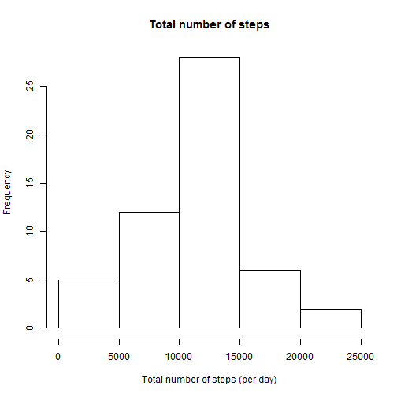
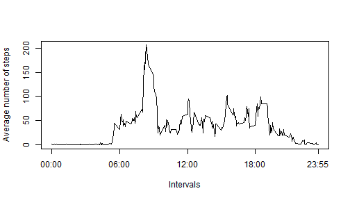
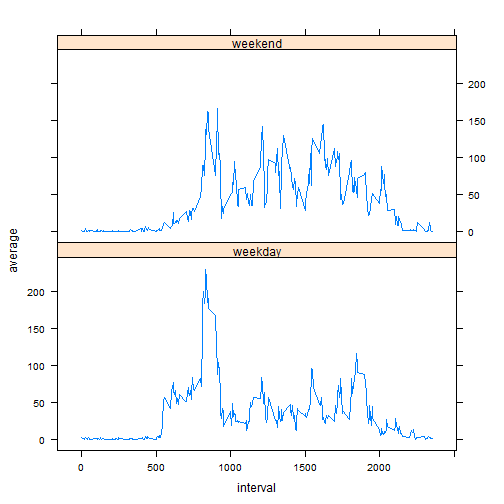

## Loading and preprocessing the data

```r
data <- read.csv(unz("activity.zip", "activity.csv"))
```
## What is mean total number of steps taken per day?

```r
aggregated <- aggregate(data[,c("steps")], by = list(data$date), na.rm=FALSE, "sum")
names(aggregated) <- c("date", "totalSteps")
hist(aggregated$totalSteps, xlab="Total number of steps (per day)", main="Total number of steps")
```

 

```r
stepMean <- mean(aggregated$totalSteps, na.rm=TRUE)
stepMedian <- median(aggregated$totalSteps, na.rm=TRUE)
```
The mean total number of steps per day is 1.0766189 &times; 10<sup>4</sup>

The median total number of steps per day is 10765

## What is the average daily activity pattern?

```r
intervalMean <- aggregate(data[,c("steps")], by = list(data$interval), na.rm=TRUE, "mean")
names(intervalMean) <- c("interval","average")
plot(intervalMean$interval, intervalMean$average, type="l", xaxt="n", xlab="Intervals", ylab="Average number of steps")
axis( 1, at = c(0, 600, 1200, 1800, 2355), labels=c("00:00", "06:00", "12:00", "18:00", "23:55"))
```

 

```r
maxNumberOfSteps <- intervalMean[which.max(intervalMean$average), "interval"]
```
835 interval contains the maximum number of steps.

## Imputing missing values

```r
totalNa <- sum(is.na(data)) 
```
The total count of missing values is 2304

After some comparison I found out that using interval median for filling missing values is the most suitable strategy.This strategy takes into account missing data across different dates and though is more relevant.

```r
library(plyr)
dataFull <- plyr::join(data, intervalMean, by = "interval")
naIndex <- is.na(dataFull$steps)
dataFull$steps[naIndex] <- dataFull$average[naIndex]
aggregatedFull <- aggregate(dataFull[,c("steps")], by = list(dataFull$date), "sum")
names(aggregatedFull) <- c("date", "totalSteps")
hist(aggregatedFull$totalSteps, xlab="Total number of steps (per day)", main="Total number of steps(without missing values)")
```

-1.png) 

```r
stepMeanFull <- mean(aggregatedFull$totalSteps)
stepMedianFull <- median(aggregatedFull$totalSteps)
```
The mean total number of steps per day after imputing missing values is 1.0766189 &times; 10<sup>4</sup>.

The median total number of steps per day after imputing missing values is 1.0766189 &times; 10<sup>4</sup>

As far as we did not take into account missing values in first part of assigment using proposed strategy did not dramatically change mean and median.  

## Are there differences in activity patterns between weekdays and weekends?

```r
library(lattice)
# to ensure days would be printed in English
Sys.setlocale("LC_TIME", "English")
```

```
## [1] "English_United States.1252"
```

```r
dataFull$weekday <- ifelse(weekdays(as.Date(as.character(dataFull$date),"%Y-%m-%d")) %in% c('Sunday','Saturday'), "weekend", "weekday")
intervalWeekdayMean <- aggregate(dataFull[,c("steps")], by = list(dataFull$interval, dataFull$weekday), "mean")
names(intervalWeekdayMean) <- c("interval","weekday", "average")
xyplot(average~ interval | weekday, data=intervalWeekdayMean,layout=c(1,2),type="l")
```

 
